# kottans-frontend

---

## Version Control with Git

The Course **"Version Control with Git"** is useful for understanding the basic principles of how to use Git in my job. I understand what is version control system and what commands are necessary to work with GIT. Also, I liked taking the course in English.

Introduction to GIT is not so hard but I know that the hardest coming next.

Pull and Push request is also cognitively but not so helpful when I create my first pull request.

 
 
Git basics
 
  
 
 
  
  
 

### Create Pull Request

I **hardly** recommended this article to everyone, who can't create his first PR. The article helps me a lot and I am sure, that the article may be useful for anyone. After reading, I have no questions left.

[How to Submit A Pull Request to Someone Else’s Repository?](https://learntocodetogether.com/create-your-first-pull-request/)

---

## Linux CLI, and HTTP

Please, look at all **tests** which I must be solved in the topic "Linux CLI, and HTTP".

 
 
Linux CLI, and HTTP
 
  
  
  
  
  
  
 

Working out the sourses, I learn so much _modern_, _interesting_ and _useful_ information! I have never used Linux before, so I can tell that experience is brand new to me. I learned a lot of valuable commands, wildcards, and flags. Now I know the difference between home and current directory. And last of all, if I forget some command or I will need an explanation, I always can use a **"man"** command.

Remarking on the articles, it is worth saying that they allowed me to understand the HTTP protocol correctly. Especially the caching process, authentication, security, and more. After reading I need to use additional materials, but I think I managed to master the material.

[A Web Developer’s Guide to Browser Caching](https://medium.com/@codebyamir/a-web-developers-guide-to-browser-caching-cc41f3b73e7c)

Anyway, I am ready for the next level.

---

## Git Collaboration

Please, look at all **tests** which I must be solved on the topic "Git Collaboration".

 
 
Git Collaboration
 
  
  
  
  
 
  
 

First of all, I need to say that I pass week 1 and week 2 in Coursera too. Just to fresh my knowledge. And I like "Introduction in Git" on Udasity more.

Also, after I did my first pull request, learning how to do it was really confusing. But I treated this as a repetition of already established material.
Learning how to do rebase was really new to me, so I can practice more and understand better how it works in Git.

After all, I am proud of myself for passing this stage.

---

## Intro to HTML and CSS

Please, look at all **tests** which I must be solved on the topic "Intro to HTML and CSS".

 
 
Intro to HTML and CSS
 
  
 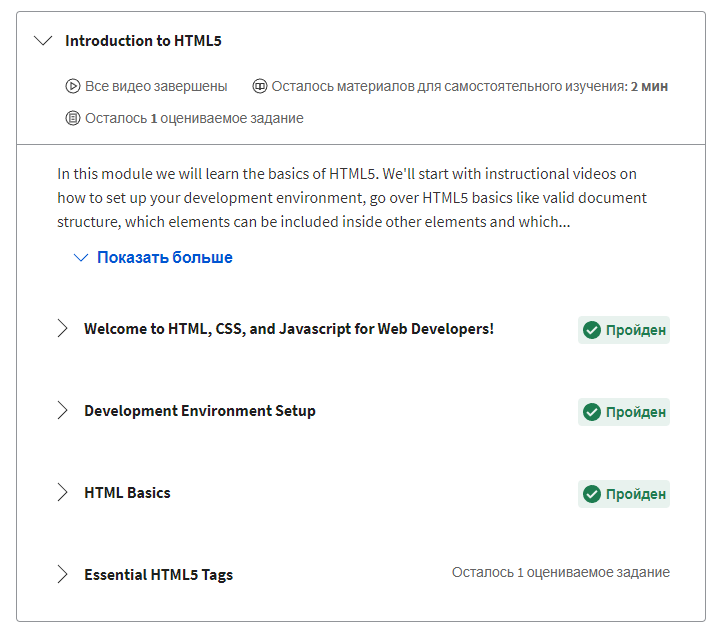 
 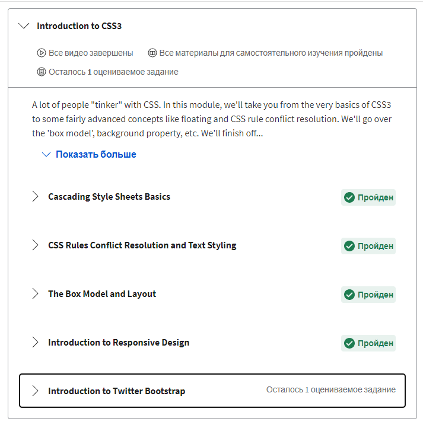 
 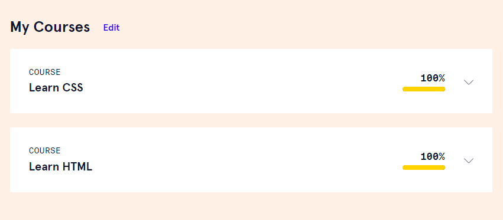  
  
 

Working out the given lectures, I repeated all the basic concepts of HTML and CSS. Can't say that it was new information to me, but I will definitely remember how to correctly understand positioning CSS offset properties.

Think about these offsets is not top or left but more like from the top and from left it was new to me.
Also, I liked Codecadamy tasks too.

---

## Responsive Web Design

Please, look at all **tests** which I must be solved on the topic "Responsive Web Design".

 
 
Responsive Web Desig
 
  
 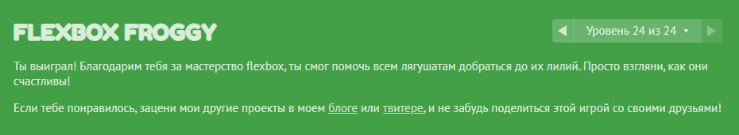 
 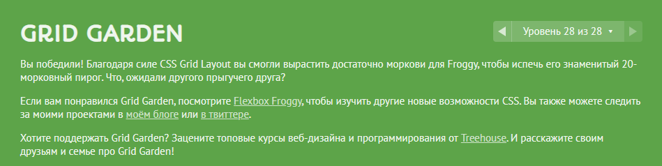  
  
 

Flex and grid are two powerful technology in CSS, so lean they are a must-have for everyone who want to be a frontend developer.
Working out the given lectures, it was nice to better know about the "flex" property and finally used it the right way in my work.

Playing games helped me quickly consolidate the material I had learned before.

Responsive design is that which it is impossible to imagine modern web content.

---

## HTML-CSS-Popup

This is my HTML CSS practice "Hooly Popup". In this task, I learned more about checkboxes and selector different combinators in CSS. Also, I repeat the BEM structure. You can see my result behind.

[Demo](https://yuliiadikun.github.io/Popup/) |

[Code base](https://github.com/YuliiaDikun/Popup)

---

## JS Basics

Please, look at all **tests** which I must be solved on the topic "JS Basics".

 
 
JS Basics
 
  
 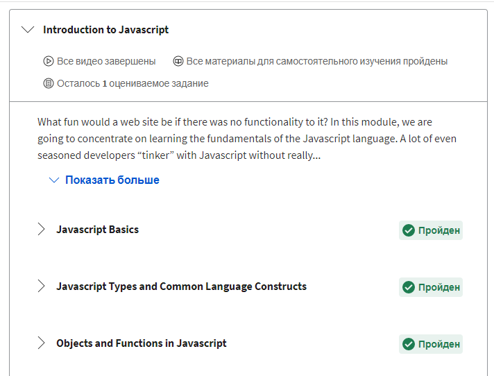 
 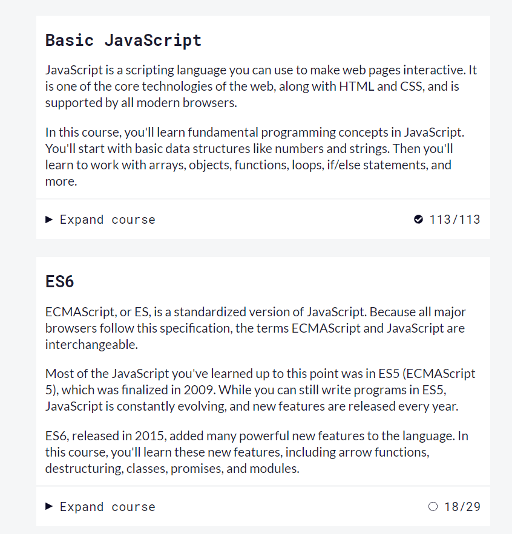  
 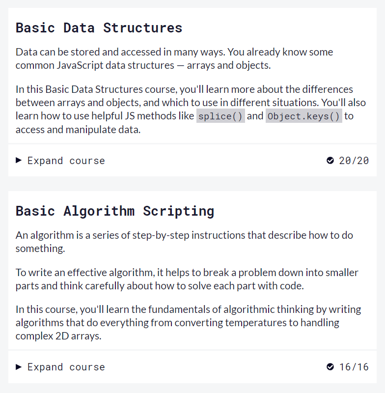
 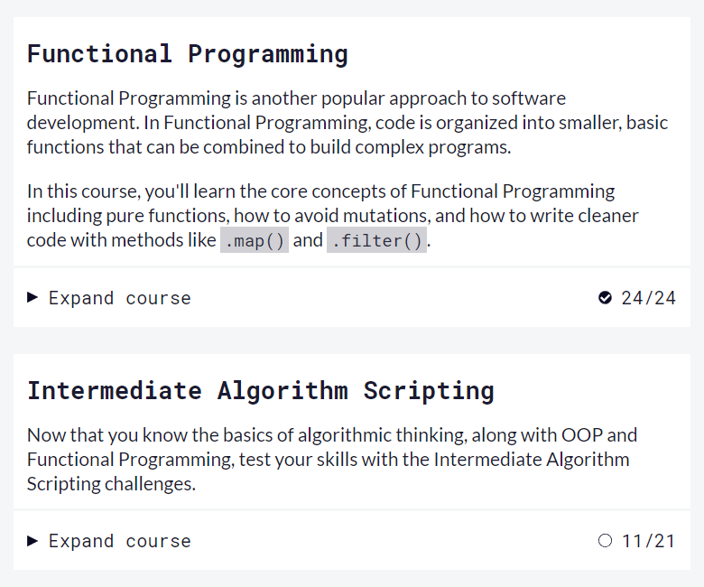
  
 

So, that was hard. Really! I learned basic JavaScript before, but I stopped an Array task. Now, I need to learn objects, dynamic typing, recursion, destructuring assignment, etc. And as I say, I only new primitive values and arrays.

The base is the main thing, so I used a lot of additional materials in this task. Also, I started a course "Full Javascript: from the beginning" on Udemy in parallel with this task. Because of this, this task took the longest time to complete.

Algorithm Scripting Challenges was the hardest and I used tips to complete it. I definitely will be back to this in the future.
Finally, I have never solved so many tasks in so much time, so I feel my mind is blown up, but keep going.

---

## DOM

Please, look at all **tests** which I must be solved on the topic "DOM".

 
 
DOM
 
  
 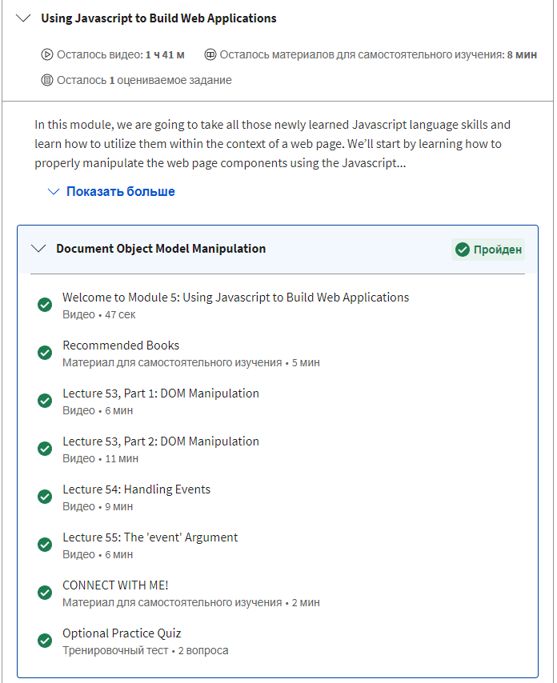 
 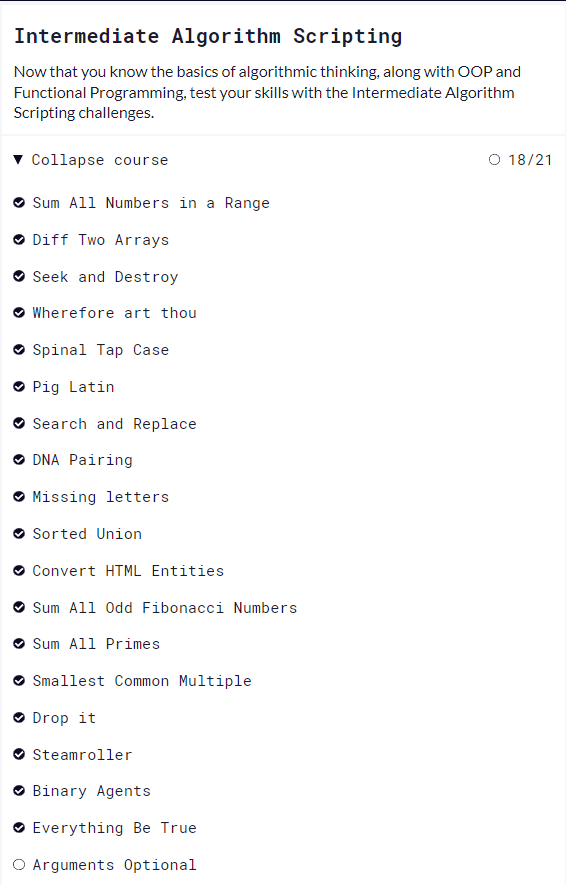

 

Also, please look at my homework:

[Demo](https://yuliiadikun.github.io/DOM/) |

[Code base](https://github.com/YuliiaDikun/DOM)

For the very first time, I got acquainted with the concepts of a document object model, listener, events in Javascript, etc. I never used it before and honestly is the first time when I write a working code by myself. As I said in the previous task, I started a full javascript course in udemy. I try learning task by task and I can't imagine how I did it without all knowledge I had in this course. Also, thanks a lot to reviewers for their time!

I hope you enjoy my homework and know something new.

---

## A Tiny JS World

Please, look at my homework:

[Demo](https://yuliiadikun.github.io/a-tiny-JS-world/) |

[Code base](https://github.com/YuliiaDikun/a-tiny-JS-world/blob/master/index.js)

That was a useful task to understand how to create an object in javascript and repeat the work with the array.prototype.map() and array.prototype.join() methods in javascript.

---

## Object Oriented JS

Please, look at my **profile** in Codewars.

 
 
Codewars
 
  
 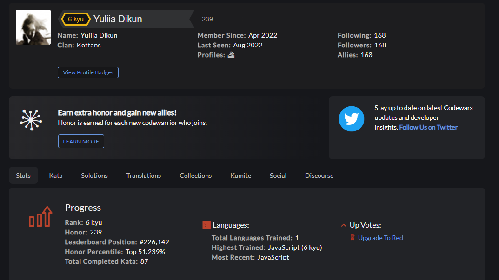

 

And look in my homework:

[Demo](https://yuliiadikun.github.io/frontend-nanodegree-arcade-game/) |

[Code base](hhttps://github.com/YuliiaDikun/frontend-nanodegree-arcade-game/blob/master/js/app.js)

This was a hard task for me. I use a lot of additional material, but I am so grateful for the reviewer, who help me improve my code. It is still hard to understand to me, why it is called object, not prototype-oriented programming. First I used a class syntax to complete this homework, but when I rewrite it in prototype syntax, I feel I am still confused.
Hope I will figure it out as soon as possible.
