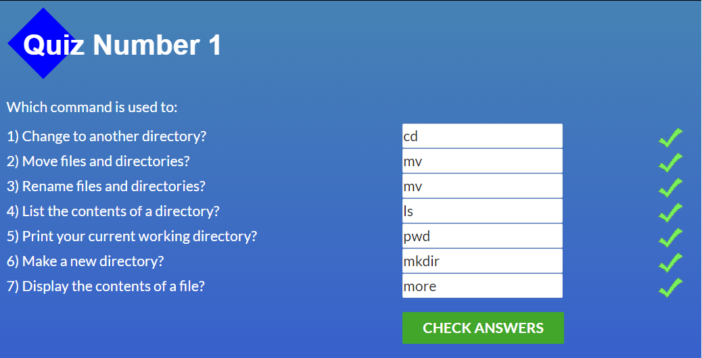
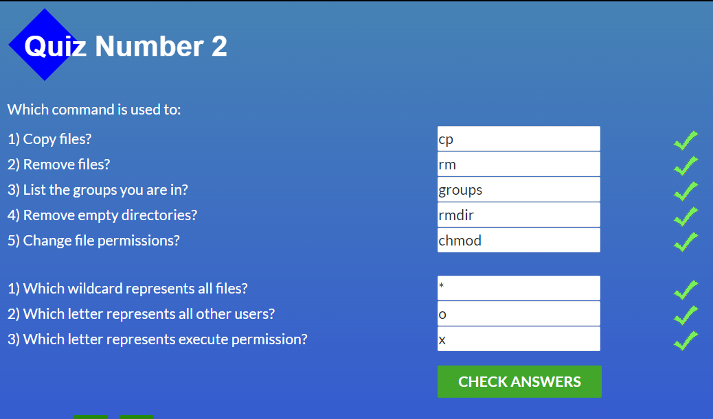
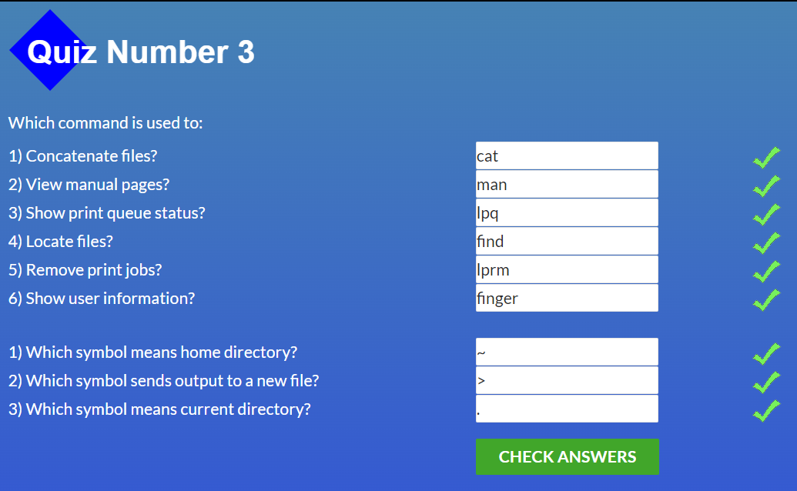
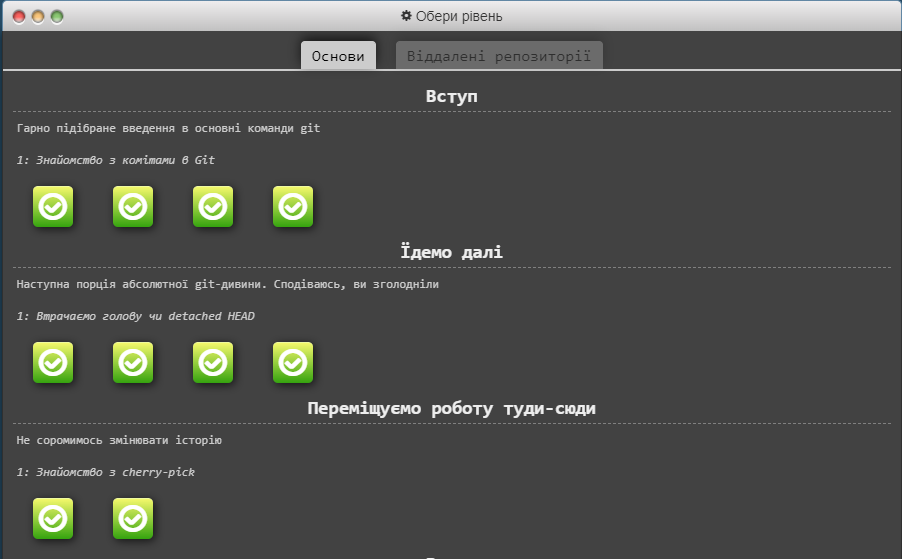
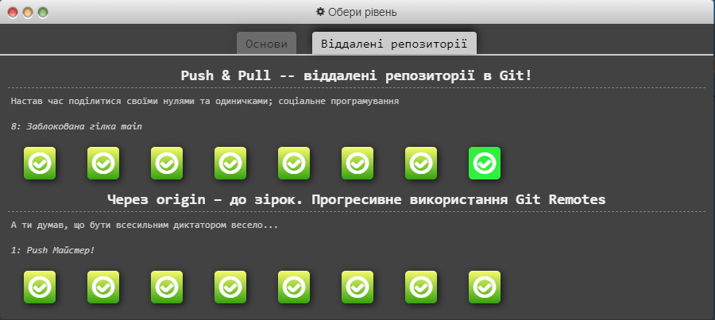
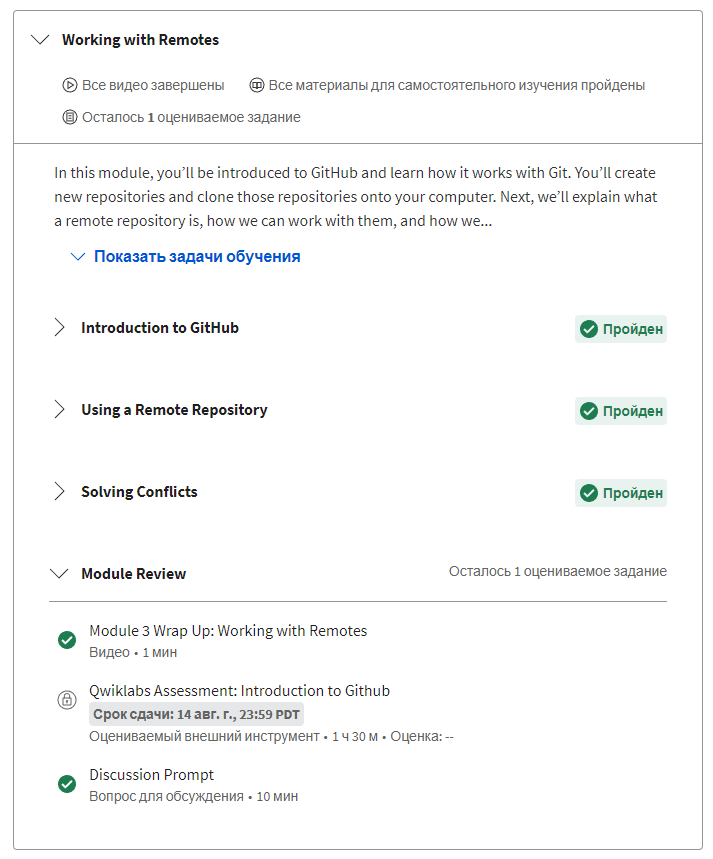
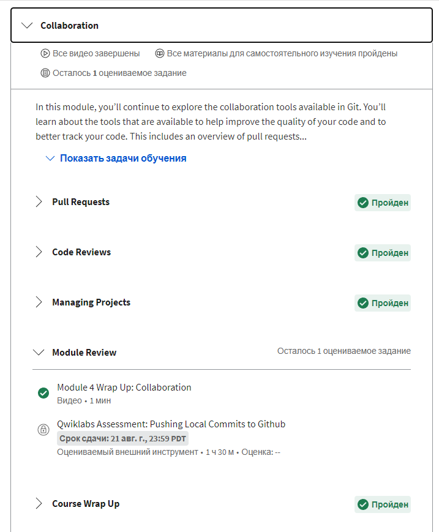

# kottans-frontend
## Version Control with Git

The Course **"Version Control with Git"** is useful for understanding the basic principles of how to use Git in my job. I understand what is version control system and what commands are necessary to work with GIT. Also, I liked taking the course in English. 

Introduction to GIT is not so hard but I know that the hardest coming next.

Pull and Push request is also cognitively but not so helpful when I create my first pull request.

 
 
Git basics
 
  
 
 
  
  
 

### Create Pull Request

I **hardly** recommended this article to everyone, who can't create his first PR. The article helps me a lot and I am sure, that the article may be useful for anyone. After reading, I have no questions left. 

[How to Submit A Pull Request to Someone Else’s Repository?](https://learntocodetogether.com/create-your-first-pull-request/)

## Linux CLI, and HTTP

Please, look at all **tests** which I must be solved in the topic "Linux CLI, and HTTP". 

 
 
Linux CLI, and HTTP
 
  
  
  
  
  
  
 

Working out the sourses, I learn so much *modern*, *interesting* and *useful* information! I have never used Linux before, so I can tell that experience is brand new to me. I learned a lot of valuable commands, wildcards, and flags. Now I know the difference between home and current directory. And last of all, if I forget some command or I will need an explanation, I always can use a **"man"** command.

Remarking on the articles, it is worth saying that they allowed me to understand the HTTP protocol correctly. Especially the caching process, authentication, security, and more. After reading I need to use additional materials, but I think I managed to master the material. 

[A Web Developer’s Guide to Browser Caching](https://medium.com/@codebyamir/a-web-developers-guide-to-browser-caching-cc41f3b73e7c)

Anyway, I am ready for the next level.

## Git Collaboration

 
 
Git Collaboration
 
  
  
  
  
 
  
 

Please, look at all tests which I must be solved on the topic "Git Collaboration". First of all, I need to say that I pass week 1 and week 2 in Coursera too. Just to fresh my knowledge. And I like "Introduction in Git" on Udasity more. 

Also, after I did my first pull request, learning how to do it was really confusing. But I treated this as a repetition of already established material. 
Learning how to do rebase was really new to me, so I can practice more and understand better how it works in Git. 

After all, I am proud of myself for passing this stage.