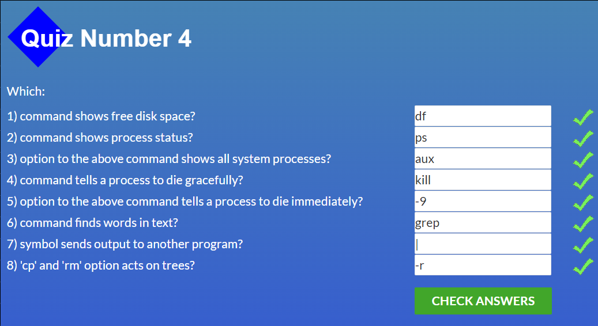

# kottans-frontend
## Version Control with Git

The Course **"Version Control with Git"** is useful for understanding the basic principles of how to use Git in my job. I understand what is version control system and what commands are necessary to work with GIT. Also, I liked taking the course in English. 

Introduction to GIT is not so hard but I know that the hardest coming next.

Pull and Push request is also cognitively but not so helpful when I create my first pull request.

## Create Pull Request

I **hardly** recommended this article to everyone who can't create his first PR. The article helps me a lot and I am sure that the article may be useful. After reading I have no questions left. 

[How to Submit A Pull Request to Someone Else’s Repository?](https://learntocodetogether.com/create-your-first-pull-request/)

## Linux CLI, and HTTP

Look at all **tests** which I must be solved in the topic "Linux CLI, and HTTP". 

 
 
Linux CLI, and HTTP
 
  
  
  
  
  
  
 

Working out the sourses, I learn so much *modern*, *interesting* and *useful* information! I have never used Linux before, so I can tell that experience is brand new to me. I learned a lot of valuable commands, wildcards, and flags. Now I know the difference between home and current directory. And last of all, if I forget some command or I will need an explanation, I always can use a **"man"** command.

Remarking on the articles, it is worth saying that they allowed me to understand the HTTP protocol correctly. Especially the caching process, authentication, security, and more. After reading the first chapter I need to use additional materials, but I think I managed to master the material. Anyway, I am ready to the next level.
